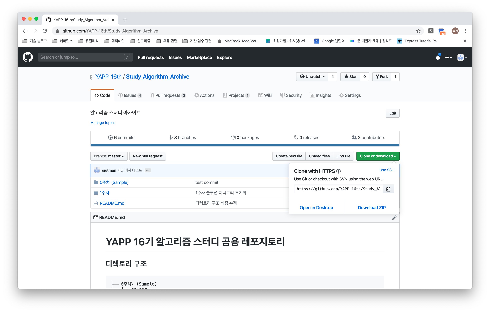
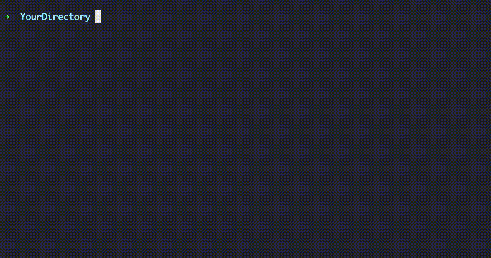
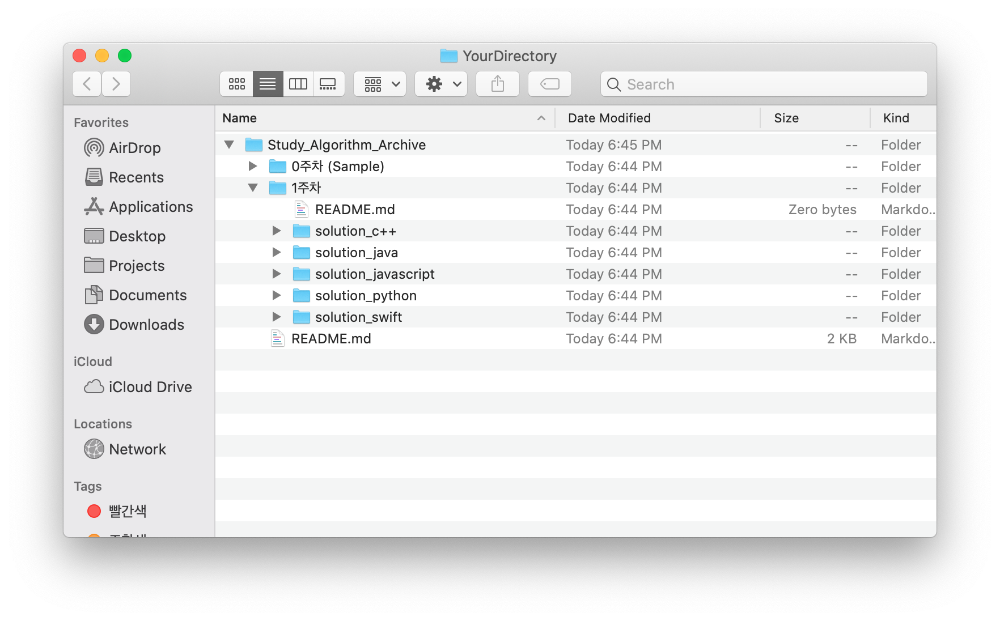
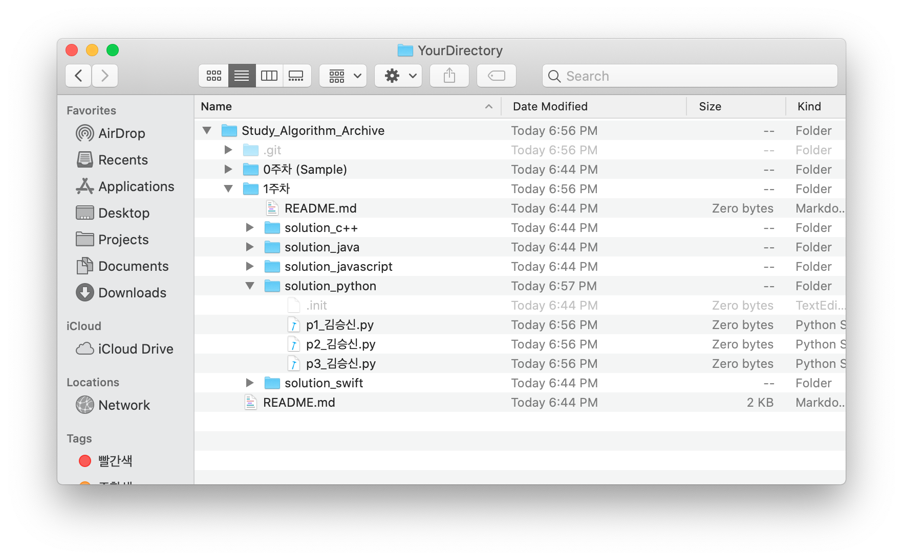
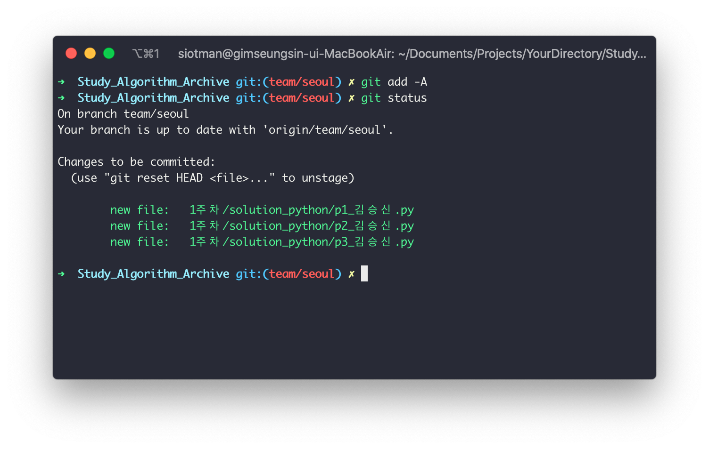
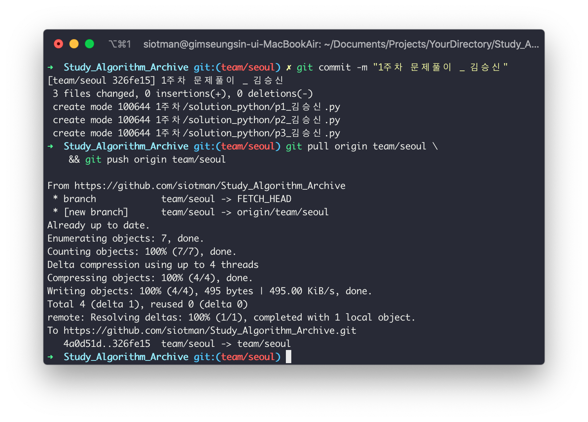
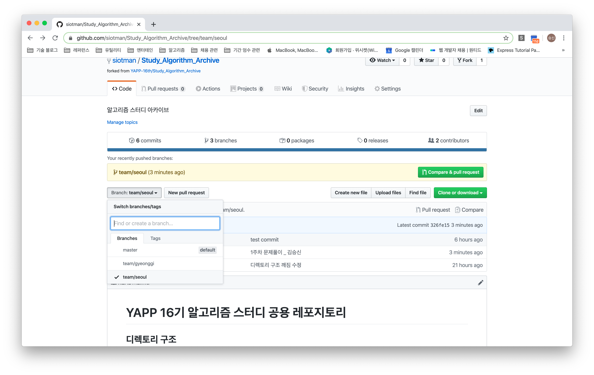
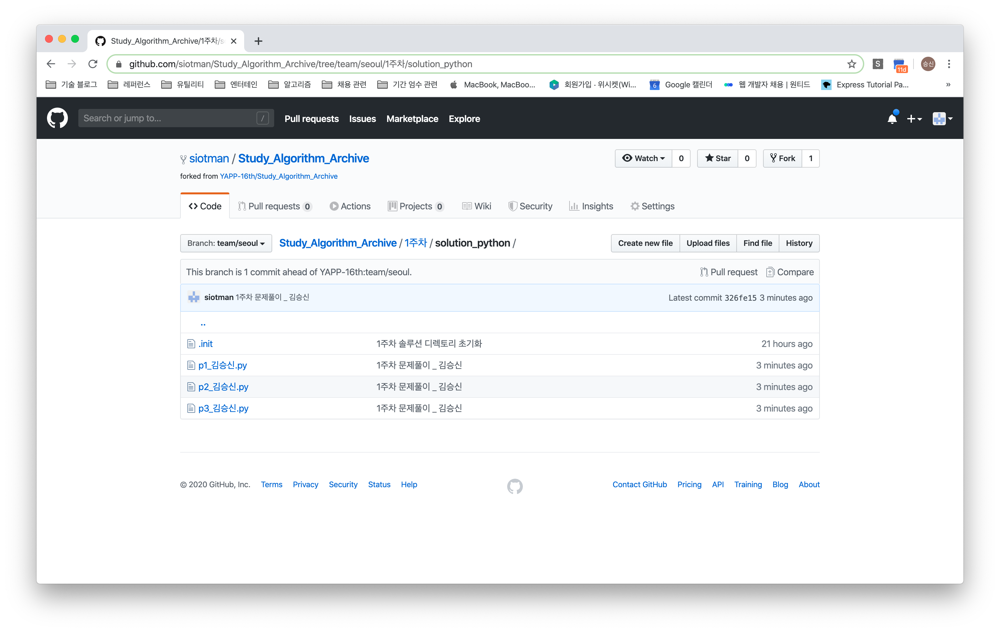

# 주차별 풀이 솔루션 소스코드 업로드 튜토리얼

깃과 깃 배쉬가 실치된 환경으로 생각하고 코드 업로드 방법을 설명합니다. 설치가 안되었다면, 아래 링크를 참조하세요.

1. [설치 방법](https://git-scm.com/book/ko/v2/%EC%8B%9C%EC%9E%91%ED%95%98%EA%B8%B0-Git-%EC%84%A4%EC%B9%98)
2. [설치 후 설정](https://git-scm.com/book/ko/v2/%EC%8B%9C%EC%9E%91%ED%95%98%EA%B8%B0-Git-%EC%B5%9C%EC%B4%88-%EC%84%A4%EC%A0%95)

## 터미널로 솔루션 업로드 하기

### 1) 원격 리포지토리에서 클론받고, 브랜치를 변경하기.

먼저, [공용 리포지토리](https://github.com/YAPP-16th/Study_Algorithm_Archive) 페이지를 엽니다.




위 그림과 같은 페이지에서 오른쪽 중단의 `Clone or download` 드롭 다운을 클릭하고, 나타나는 링크를 복사합니다. 복사하셨다면, 각자의 환경에 맞는 터미널을 실행합니다. 



그리고, 위의 그림처럼 리포지토리를 클론한 뒤, 브랜치를 변경합니다. 커맨드 스니펫은 아래와 같습니다.

```shell
# 서울팀
git clone https://github.com/YAPP-16th/Study_Algorithm_Archive.git \
    && cd Study_Algorithm_Archive \
    && git fetch origin team/seoul \
    && git checkout team/seoul

# 경기팀
git clone https://github.com/YAPP-16th/Study_Algorithm_Archive.git \
    && cd Study_Algorithm_Archive \
    && git fetch origin team/gyeonggi \
    && git checkout team/gyeonggi
```


아래와 같이 프로젝트를 다운로드 받았다면, 성공입니다.
이제 문제를 푸시면 됩니다.



### 2) 코드를 커밋하고, 푸쉬하기.

문제를 푸신 뒤, 작성한 소스코드를 `p문제번호_본인이름.확장자` 형태로 저장하시고, 본인의 언어에 맞는 폴더에 아래와 같이 넣어주세요.



다시 터미널로 돌아가겠습니다. 아래의 커맨드 스니펫을 복사하여, 터미널에 붙여넣고 엔터를 눌러 파일을 `stage`하세요.

```shell
git add -A && git status
```



위와 같이 추가한 파일명이 보여야합니다. 파일명이 보이지 않는다면, 파일이 폴더에 추가되지 않았거나, 이미 커밋한 경우일 수 있습니다.

파일명에 실수가 없는지, 소스코드를 잘못 올리지는 않았는지 다시한번 확인해주세요. 이제 `stage`한 파일을 `commit`하고 `push`하겠습니다.

```shell
git commit -m "<커밋 메세지>"
```

`<커밋 메세지>`는 정한 양식이 없습니다. 자유롭게 작성해주세요. 예를 들어, `git commit -m "1주차 문제풀이 _ 김승신"` 이렇게 작성할 수 있겠습니다. 

그리고, 다음 명령어을 실행합니다.

```shell
# 서울팀
git pull origin team/seoul \
    && git push origin team/seoul

# 경기팀
git pull origin team/gyeonggi \
    && git push origin team/gyeonggi
```

아래는 명령어를 수행하고 난 뒤의 터미널의 모습입니다.



### 3) 코드가 잘 올라갔는지 확인하기

이제, [공용 리포지토리](https://github.com/YAPP-16th/Study_Algorithm_Archive)에 코드가 잘 올라갔는지 확인하겠습니다. 공용 리포지토리 페이지 왼쪽 중단의 `branch: master` 드롭다운을 눌러 팀 브랜치로 변경해주세요.



이후, 업로드한 파일 경로로 들어가서, 파일이 잘 올라왔는 지 확인합니다.



잘 올라왔나요? 고생많으셨습니다. 추가적인 질문이 있다면, 얼마든지 DM주세요.

감사합니다.